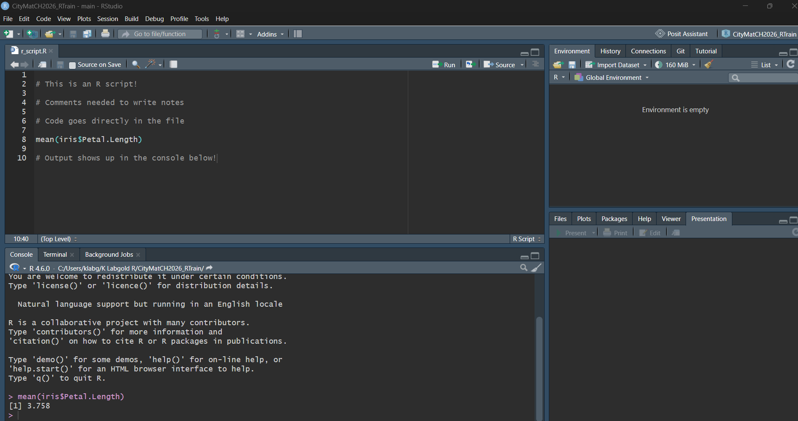
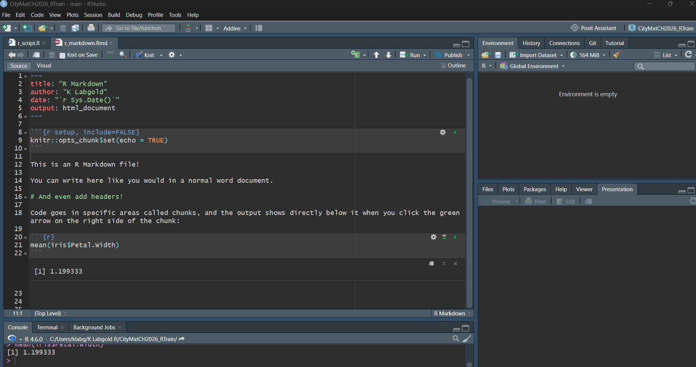
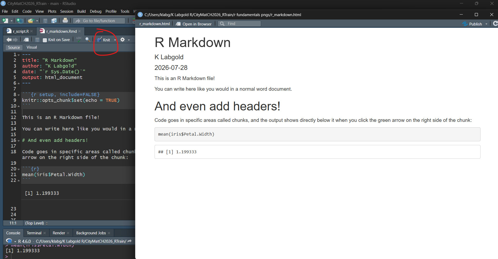
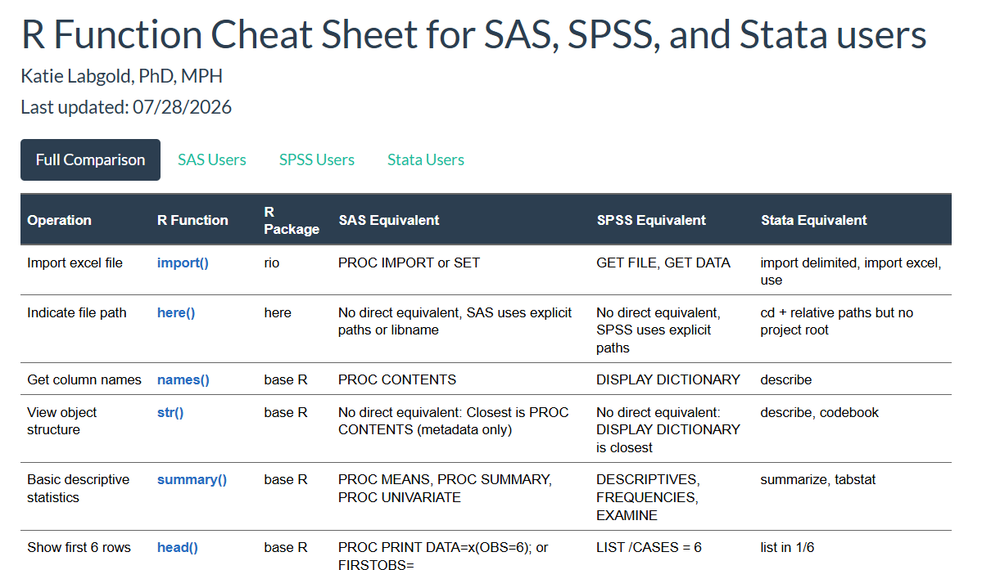

## Welcome to R for Applied MCH Epidemiologists!

Please make sure you have R and R studio installed, and have downloaded the workshop materials: <https://github.com/Katie-Labgold/CityMatCH2026_R_Training_Labgold>

{fig-align="center"}

## The wonderful world of R!

<br>

**My Goal:** In 20 minutes or less, introduce you to some R fundamentals (*with a focus on differences from your usual software*) that will before diving into the rest of the workshop.

::: {.notes}
But first, let me introduce myself!
:::

## Katie Labgold, PhD, MPH

{fig-align="center" width="231"}

- Applied MCH Epidemiologist and R enthusiast!
- PhD in Epidemiology from Emory University
- R user for 11 years (SAS convert)
- Fun fact: I've worked in all aspects of STLT!

## 1. R Studio Environment

{fig-align="center" width="388"}

::: notes
Go ahead an open your R Studio and let's take a quick tour of the setup.

You'll notice your screen looks a bit different than mine to start. Click `file` , `New File`, & `R script`. Now we all should have 4 main panels.

1.  On the top left, is our source pane. This is where we write code and view our data. This is similar to your SAS editor, SPSS syntax editor, or Stata Do-file editor.

2.  On the bottom left is the console pane. This is where R actually runs your commands. anything you type here runs immediately - similar to the SAS log, SPSS output viewer, or Stata command window.

3.  The top right is our environment pane. This area shows us what's currently in memory (objects, data frames, functions - which we will discuss all of in more detail soon).

4.  And lastly the bottom right is our files/plots/packages/help/viewer pane. This area is multipurpose for file navigation, plots we generate, installed packages, and help documentation.

    For 3 & 4, some statistical packages have similar features (e.g. file browsing) but none follow the same direct setup.
:::

## 2. Projects

Projects are self-contained workspaces which we can use to hold all of our scripts, data, and settings.

{fig-align="center" width="500"}

::: {#sequential-reveal .fragment}
Similar to a libname (SAS) or working directory (SPSS, STATA) but for all of your R materials used in a single project.
:::

## 2. Projects cont.

You already have a project set up for today!

<br>

You'll see our project in your CityMatCH2026_RTrain folder downloaded from GitHub.

<br>

{fig-align="center"}

<br>

::: fragment
To set up a new project for your next analysis, follow [these steps](https://intro2r.com/rsprojs.html).
:::

## 3. Coding in R: R Scripts

{fig-align="center" width="588"}

## 3. Coding in R: R Markdown

{fig-align="center"}

## 3. Coding in R: R Markdown

Advantages of R Markdown:

- When want a clean output to share (word, pdf, or html)

- When want to write a lot of documentation (vs using comments)

{fig-align="center"}

## 4. Objects

One of the biggest differences of R vs other statistical programs is that R is an **object oriented language**.

<br>

*Meaning:*

1.  Everything we interact with in the R workspace is an object (vectors, data frames, models, plots, functions)
2.  Objects have classes
3.  Functions behave differently depending on the object's class

## 4. Objects cont.

<br>

**Why do we care?**

<br>

::: fragment
Understanding this helps make sense why R functions behave the way that they do.
:::

## 4. Objects cont.

In our project, we'll start by working with a specific object type known as a data frame.

<br>

```{r}
#| echo: true

str(iris)

```

<br>

```{r}
#| echo: true
head(iris$Petal.Length)
```

<br>

```{r}
iris[1, 3] # pull row 1, column 3
```

::: notes
In our project, we'll start by working with a specific object type known as a data frame. Here I'm using the example data `iris` that built into the R environment.

`str()` tells us that this object is a data frame with 150 observations and 5 variables

The `$` is marked before each variable. This tells us the structure for how to access it.

\[\] single brackets for slicing
:::

## 4. Objects cont.

<br>

We can make a new object by assigning the old object to a new object using either `<-` or `=` (`<-` is preferred)

<br>

```{r}
#| echo: true
#| results: false

iris2 <- iris


iris3 = iris

```

<br>

::: fragment
**Note**: Object names cannot start with numbers! E.g. `2024data` would return an error.
:::

## 5. Packages

<br>

We can install packages in R using the following function.

<br>

```{r}
#| echo: true
#| eval: false

install.packages("dplyr")

```

<br>

::: fragment
We only need to install a package one time (other than the occasional update).
:::

## 5. Packages cont.

<br>

Once a package has been installed, we can load it by calling:

<br>

```{r}
#| echo: true

library(dplyr)

```

<br>

::: fragment
**Did you notice**: `install.packages()` needed quotes, but `library()` did not!
:::

## 6. Syntax Snippets - File Paths

R uses forward slashes "`/`". If you have a Windows (PC), your file path natively uses backslashes `\`.

<br>

For example, my copied file path is: `"C:\Users\klabg\K Labgold R\CityMatCH2026_RTrain"` but you'll need to switch it to:

```{r}
#| echo: true
#| eval: false

"training_data_files/clean/births20to24_final.RData"

```

<br>

::: fragment
**Quick tip:** When you start typing quotes in R, you can hit the `tab` key, and it will show you options for file path steps.
:::

## 6. Syntax Snippets - Functions

<br>

In R, all function calls need parentheses:

<br>

```{r}
#| echo: true
#| eval: false
#| results: false

print(iris)

mean(iris$Petal.Width)

library(dplyr)

```

## 6. Syntax Snippets - Case Sensitivity

<br>

R is case sensitive...no exceptions. This includes:

- object names

- function names

- column names

- package names

<br>

::: fragment
**All names are case-sensitive!**
:::

## 6. Syntax Snippets - Quotes

Quotes are needed when referring to text, such as:

1.  Strings (literal text): `"setosa"`
2.  File paths: `"data/file.csv"`
3.  Factor levels
4.  Non-standard variable names: `"Age (Years)"`, `"2024_values"`, `"zip-codes"`

<br>

::: fragment
Quotes are **not** used for object names, variable names in formulas, or function names.
:::

## 7. Piping

In R, we can string together multiple R commands to form a single step using a **pipe** (`%>%` or `|>`).

<br>

```{r}
#| echo: true

iris %>%
  mutate(length.plus.width = Petal.Width + Petal.Length) %>%
  select(Petal.Width, Petal.Length, Species, length.plus.width) %>%
  head()
  

```

::: notes
This would be similar to writing a clean, top-to-bottom workflow in your usual program rather than writing as separate procedures.
:::

## 8. Commenting

<br>

We can comment in R using `#` then writing the comment. The comment will continue until you enter to the next line.

<br>

```{r}
#| echo: true
#| results: false

iris %>% # original object
  mutate(length.plus.width = Petal.Width + Petal.Length) %>% # make new variable
  select(Petal.Width, Petal.Length, Species, length.plus.width) %>% # select variables
  head() # show first 6 rows 

```

## 9. R Cheat Sheet for SAS, SPSS, Stata Users

Throughout the day, you can reference this cheat sheet to build intuition about R syntax:

{fig-align="center"}

::: fragment
*Notice an error or have suggestions for the SAS, SPSS, or Stata example code - let me know!*
:::

## 10. Questions?

<br>

That should be enough to get us started! Any questions before we dive in?

<br>

**P.S. did I mention this presentation was made exclusively in R?**
