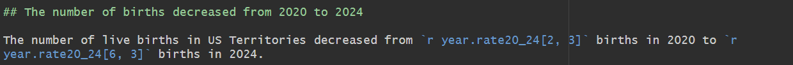
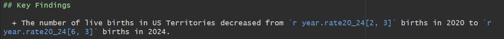
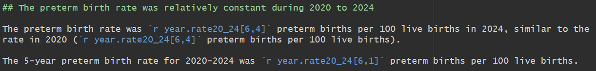
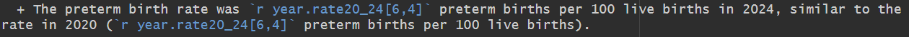
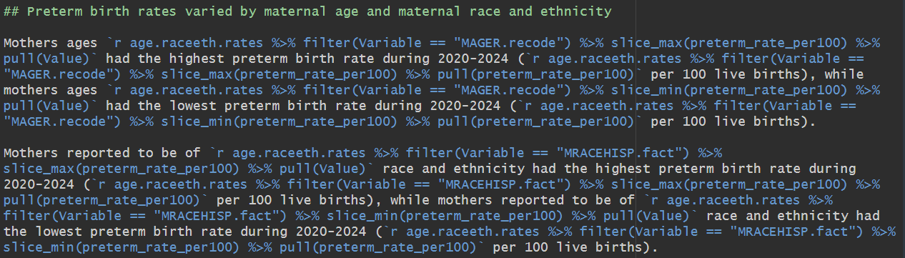
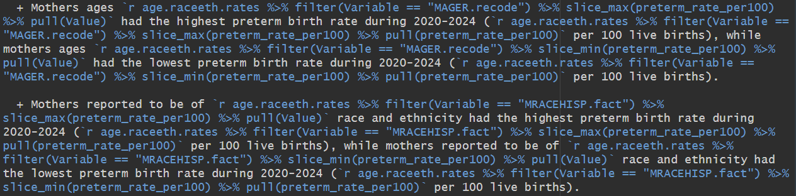
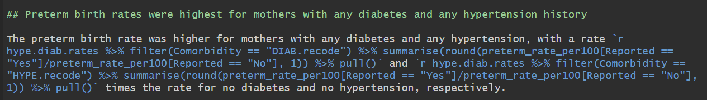
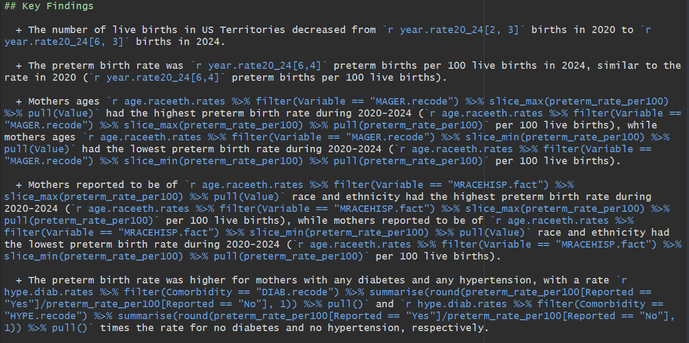

<script>
function toggleFig(id) {
  var x = document.getElementById(id);
  x.style.display = (x.style.display === "none") ? "block" : "none";
}
</script>

```{r, include=FALSE}
knitr::opts_chunk$set(echo = TRUE)

# load packages
library(here)
library(dplyr)
library(flextable)
library(ggplot2)

# After Part 2, Step #3 of data_prep.rmd, load `births20to24_basicsummary`
load(here("training_data_files", "clean", "births20to24_basicsummary.rdata"))

# After Part 2, Step #4 of data_prep.rmd, load `age.raceeth.rates`
load(here("training_data_files", "clean", "age_raceeth_rates.rdata"))

# After Part 3, Step #5 of data_prep.rmd, load `hype.diab.rates`
load(here("training_data_files", "clean", "hype_diab_rates.rdata"))

```

# Objective

Our final output will have:

+ Key findings summaries with numbers that automatically update from R code
+ Table of preterm birth rates by year
+ Line graph of preterm birth rates by year
+ Horizontal bar chart of preterm birth rates by maternal age and maternal race and ethnicity
+ Vertical bar chart of preterm birth rates by any diabetes and any hypertension history
+ A recommendations figure
+ Data source and methods, with link to CDC NCHS documentation


Let's take a quick look at what our final report output goal will look like (report-final.docx).


# Visualizations for Data Prep Part #3

We will start off by loading our data in the `setup` R chunk at the top of the report R Markdown file.

```{r setup, eval = FALSE}
knitr::opts_chunk$set(echo = TRUE)

# load packages
library(here)
library(dplyr)
library(flextable)
library(ggplot2)

# After Part 2, Step #3 of data_prep.rmd, load `births20to24_basicsummary`
load(here("training_data_files", "clean", "births20to24_basicsummary.rdata"))
```

## Yearly Rate Table

Since we already have a dataframe set up how we would like our data to be viewed, we predominately need to focus on table formatting.

We can start with a simple flextable, similar to what we used during data preparation:
```{r tbl.pt3 code, eval = F}
tbl.pt3 <- year.rate20_24 %>%
            rename("Preterm Births per 100 Live Births" = "preterm_rate_per100") %>% # Rename variable 
            flextable() %>%
            theme_vanilla() # Applies a clean theme

tbl.pt3
```

<button onclick="toggleFig('tbl.pt3')">Table 3.1 Output</button>
<div id="tbl.pt3" style="display:none;">
```{r tbl.pt3 output, echo = F}
tbl.pt3 <- year.rate20_24 %>%
            rename("Preterm Births per 100 Live Births" = "preterm_rate_per100") %>% # Rename variable 
            flextable() %>%
            theme_vanilla() # Applies a clean theme

tbl.pt3
```
</div>

<br>
<br>

In R, almost anything is possible when it comes to customization. Let's update the:

1. Header background color
2. Header text color
3. Bold the year column
4. Add a table caption

<button onclick="toggleFig('tbl.pt3_2')">Table 3.2 Code</button>
<div id="tbl.pt3_2" style="display:none;">
```{r tbl.pt3_2 code, eval = F}
tbl.pt3_2 <- tbl.pt3 %>%
              bg(i = 1, bg = "#5B3DB2", part = "header") %>% # Background color for header
              color(i = 1, color = "white", part = "header") %>% # Header text white
              bold(j = ~ `Birth Year`) %>%             # Bold a specific column
              set_caption(caption = "Table 1: Preterm Birth Rates by Year") # Set table caption

tbl.pt3_2
```
</div>

<button onclick="toggleFig('tbl.pt3_2_output')">Table 3.2 Output</button>
<div id="tbl.pt3_2_output" style="display:none;">
```{r tbl.pt3_2 output, echo = F}
tbl.pt3_2 <- tbl.pt3 %>%
              bg(i = 1, bg = "#5B3DB2", part = "header") %>% # Background color for header
              color(i = 1, color = "white", part = "header") %>% # Header text white
              bold(j = ~ `Birth Year`) %>%             # Bold a specific column
              set_caption(caption = "Table 1: Preterm Birth Rates by Year") # Set table caption

tbl.pt3_2
```
</div>

<br>
<br>

There is some formatting that will be helpful when it comes to exporting our report into a word document format.

Here, we add code to format the column widths (*I did this over a few iterations of export to word*) and force the table to stay together rather than splitting across pages.

<button onclick="toggleFig('tbl.pt3_3')">Table 3.3 Code</button>
<div id="tbl.pt3_3" style="display:none;">
```{r tbl.pt3_3 code, eval = F}
tbl.pt3_3 <- tbl.pt3_2 %>%
              width(j = c("Birth Year", "Preterm Births", "Live Births", "Preterm Births per 100 Live Births"), # set column widths
                width = c(1.5, 1.2, 1.2, 2)) %>%
              paginate(init = TRUE) # keeps the rows together (not splitting between pages in word)

tbl.pt3_3
```
</div>

<button onclick="toggleFig('tbl.pt3_3_output')">Table 3.3 Output</button>
<div id="tbl.pt3_3_output" style="display:none;">
```{r tbl.pt3_3 output, echo = F}
tbl.pt3_3 <- tbl.pt3_2 %>%
              width(j = c("Birth Year", "Preterm Births", "Live Births", "Preterm Births per 100 Live Births"), # set column widths
                width = c(1.5, 1.2, 1.2, 2)) %>%
              paginate(init = TRUE) # keeps the rows together (not splitting between pages in word)

tbl.pt3_3
```
</div>

### Try it on your own!

Using the flextable cheat sheet, try adding a code line to center the text of all columns: https://ardata-fr.github.io/flextable-book/static/pdf/cheat_sheet_flextable.pdf

<button onclick="toggleFig('tbl.pt3_4')">Table 3.4 Code</button>
<div id="tbl.pt3_4" style="display:none;">
```{r fig.pt3_4 code, eval = F}
tbl.pt3_4 <- tbl.pt3_3 %>%
              align(align = "center", part = "all")

tbl.pt3_4
```
</div>

<button onclick="toggleFig('tbl.pt3_4_output')">Table 3.4 Output</button>
<div id="tbl.pt3_4_output" style="display:none;">
```{r fig.pt3_4 output, echo = F}
tbl.pt3_4 <- tbl.pt3_3 %>%
              align(align = "center", part = "all")

tbl.pt3_4
```
</div>

<br>
<br>

We can now go in and fill our header and summary (already completed in your doc!)

```{r, echo = F}

```

As well as our key findings:

```{r, echo = F}

```

<div class="alert alert-info">
Notice the text in blue! That is in-text R code that we can build into the summary text so that our number estimates update automatically if we were to make any data changes. How cool is that?
</div>

<br>
<br>
<br>
<br>

## Yearly Rate Line Graph

Moving on to our yearly rate line graph, let's start with a simple line plot. 

We still have the `Overall 2020-2024` row in our data, so we'll need to start by filtering that out. We can pipe this directly into the ggplot2() functions!


```{r fig.pt3 code, eval = F}
fig.pt3 <- year.rate20_24 %>%
                filter(`Birth Year` != "Overall 2020-2024") %>% # remove Overall row
                mutate(`Birth Year` = as.numeric(`Birth Year`)) %>% # ggplot2 wants year to be ordered, so I transform it a numeric type
                ggplot(aes(x = `Birth Year`, y = `preterm_rate_per100`)) + # aes() is used to stylize aesthetics - specify the x and y axis variables here
                        geom_line(size = 1.5, color = "steelblue") + # add a line of this size and color
                        geom_point(size = 3, color = "black") + # add points of this size and color
                        labs( # add labels
                          title = "Figure 1. Preterm Birth Rate per 100 Live Births, U.S. Territories, 2020-2024",
                          x = "Year",
                          y = "Preterm Birth Rate per 100"
                        ) +
                        theme_minimal() # minimal theme

fig.pt3
```

<button onclick="toggleFig('fig.pt3_output')">Figure 3 Output</button>
<div id="fig.pt3_output" style="display:none;">
```{r fig.pt3 output, echo = F, warning = F}
fig.pt3 <- year.rate20_24 %>%
                filter(`Birth Year` != "Overall 2020-2024") %>% # remove Overall row
                mutate(`Birth Year` = as.numeric(`Birth Year`)) %>% # ggplot2 wants year to be ordered, so I transform it a numeric type
                ggplot(aes(x = `Birth Year`, y = `preterm_rate_per100`)) + # aes() is used to stylize aesthetics - specify the x and y axis variables here
                        geom_line(size = 1.5, color = "steelblue") + # add a line of this size and color
                        geom_point(size = 3, color = "black") + # add points of this size and color
                        labs( # add labels
                          title = "Figure 1. Preterm Birth Rate per 100 Live Births, U.S. Territories, 2020-2024",
                          x = "Year",
                          y = "Preterm Birth Rate per 100"
                        ) +
                        theme_minimal() # minimal theme

fig.pt3
```
</div>

<div class="alert alert-info">
Notice that R data preparation steps use the `%>%` but ggplot2 steps build with `+`!
</div>

<br>
<br>

Let's continue to clean up this figure:

1. Remove X axis title (since year is obvious)
2. Add limits to the Y axis
3. Change dot and line colors to match each other
4. Bold X and Y axis tick numbers for improved readability

<button onclick="toggleFig('fig.pt3_2_code')">Figure 3.2 Code</button>
<div id="fig.pt3_2_code" style="display:none;">
```{r fig.pt3_2 code, eval = F}
fig.pt3_2 <- year.rate20_24 %>%
                  filter(`Birth Year` != "Overall 2020-2024") %>%
                  mutate(`Birth Year` = as.numeric(`Birth Year`)) %>% 
                  ggplot(aes(x = `Birth Year`, y = `preterm_rate_per100`)) +
                          geom_line(size = 1.5, color = "black") + # Change line color to black
                          geom_point(size = 3, color = "black") +
                          labs(
                            title = "Figure 1. Preterm Birth Rate per 100 Live Births, U.S. Territories, 2020-2024",
                            x = NULL, # Remove X axis title
                            y = "Rate per 100 Live Births"
                          ) +
                          theme_minimal() +
                          ylim(0, 15) + # Change y-axis limits to range from 0 to 15
                          theme(
                            axis.text = element_text(face = "bold", size = 12), # bold axis text
                            axis.title = element_text(face = "bold", size = 13) # bold axis text
                          )

fig.pt3_2
```
</div>

<button onclick="toggleFig('fig.pt3_2_output')">Figure 3.2 Output</button>
<div id="fig.pt3_2_output" style="display:none;">
```{r fig.pt3_2 output, echo = F, warning = F}
fig.pt3_2 <- year.rate20_24 %>%
                  filter(`Birth Year` != "Overall 2020-2024") %>%
                  mutate(`Birth Year` = as.numeric(`Birth Year`)) %>% 
                  ggplot(aes(x = `Birth Year`, y = `preterm_rate_per100`)) +
                          geom_line(size = 1.5, color = "black") + # Change line color to black
                          geom_point(size = 3, color = "black") +
                          labs(
                            title = "Figure 1. Preterm Birth Rate per 100 Live Births, U.S. Territories, 2020-2024",
                            x = NULL, # Remove X axis title
                            y = "Rate per 100 Live Births"
                          ) +
                          theme_minimal() +
                          ylim(0, 15) + # Change y-axis limits to range from 0 to 15
                          theme(
                            axis.text = element_text(face = "bold", size = 12), # bold axis text
                            axis.title = element_text(face = "bold", size = 13) # bold axis text
                          )

fig.pt3_2
```
</div>

<br>
<br>


I think it would look really nice to have the 2024 data point highlighted purple, and then add the value above it also in purple. To do this, let's build off of the last plot:

<button onclick="toggleFig('fig.pt3_3_code')">Figure 3.3 Code</button>
<div id="fig.pt3_3_code" style="display:none;">
```{r fig.pt3_3 code, eval = F}
fig.pt3_2 +
    geom_point( # add a new geom_point
    data = year.rate20_24 %>% filter(`Birth Year` == "2024"), # filtered only to 2024
    aes(as.numeric(`Birth Year`), preterm_rate_per100), # ensure the birth year is numeric type
    color = "#5B3DB2", # specify the color
    size = 3 # and point size
  ) +
  geom_text( # add text
    data = year.rate20_24 %>% filter(`Birth Year` == "2024"),
    aes(as.numeric(`Birth Year`), preterm_rate_per100, label = preterm_rate_per100),
    vjust = -1, # adjusted vertically
    color = "#5B3DB2",
    fontface = "bold"
  )
```
</div>

<button onclick="toggleFig('fig.pt3_3_output')">Figure 3.3 Output</button>
<div id="fig.pt3_3_output" style="display:none;">
```{r fig.pt3_3 output, echo = F, warning = F}
fig.pt3_2 +
    geom_point( # add a new geom_point
    data = year.rate20_24 %>% filter(`Birth Year` == "2024"), # filtered only to 2024
    aes(as.numeric(`Birth Year`), preterm_rate_per100), # ensure the birth year is numeric type
    color = "#5B3DB2", # specify the color
    size = 3 # and point size
  ) +
  geom_text( # add text
    data = year.rate20_24 %>% filter(`Birth Year` == "2024"),
    aes(as.numeric(`Birth Year`), preterm_rate_per100, label = preterm_rate_per100),
    vjust = -1, # adjusted vertically
    color = "#5B3DB2",
    fontface = "bold"
  )
```
</div>

<br>
<br>

### Try it on your own!

Using the prior section as an example, write a header, summary, and key finding for this section.

<button onclick="toggleFig('pt3_2_headersummary')">Header and Summary</button>
<div id="pt3_2_headersummary" style="display:none;">
```{r, echo = F}

```
</div>

<button onclick="toggleFig('pt3_2_keyfindings')">Key Findings</button>
<div id="pt3_2_keyfindings" style="display:none;">
```{r, echo = F}

```
</div>

<br>
<br>

<div class="alert alert-danger">
<strong>Break!</strong> After the break, we'll start back up in the data_prep R Markdown file!
</div>

# Visualizations for Data Prep Part #4

We will start off by adding our newest data in the `setup` R chunk at the top of the report R Markdown file.

```{r eval = FALSE}
knitr::opts_chunk$set(echo = TRUE)

# load packages
library(here)
library(dplyr)
library(flextable)
library(ggplot2)

# After Part 2, Step #3 of data_prep.rmd, load `births20to24_basicsummary`
load(here("training_data_files", "clean", "births20to24_basicsummary.rdata"))

# After Part 2, Step #4 of data_prep.rmd, load `age.raceeth.rates`
load(here("training_data_files", "clean", "age_raceeth_rates.rdata"))
```

<br>
<br>

Our end goal is to have both age and race and ethnicity variables be side by side in the same figure. However, it'll be easiest to first customize and format the figure based on one variable, and then adapt the code to accomodate additional variables.

<br>
<br>

## Age

Let's start with a simple bar chart of preterm birth rates by maternal age groups:

```{r fig.pt4 code, eval = F}
fig.pt4 <- age.raceeth.rates %>%
            filter(Variable == "MAGER.recode") %>% # Filter to only the age variable
            ggplot(aes(x = Value, y = preterm_rate_per100, fill = "Variable")) + # set variables
                  geom_col(position = "dodge") + # bar chart, with bars sitting next to each other (dodge)
                  labs( # basic figure labels
                    x = NULL,
                    y = "Rate per 100 Live Births",
                    fill = "Maternal Age"
                  ) +
                  theme_minimal() # basic theme

fig.pt4
```
 

<button onclick="toggleFig('fig.pt4_output')">Figure 4.1 Output</button>
<div id="fig.pt4_output" style="display:none;">
```{r fig.pt4 output, echo = F}
fig.pt4 <- age.raceeth.rates %>%
            filter(Variable == "MAGER.recode") %>% # Filter to only the age variable
            ggplot(aes(x = Value, y = preterm_rate_per100, fill = "Variable")) + # set variables
                  geom_col(position = "dodge") + # bar chart, with bars sitting next to each other (dodge)
                  labs( # basic figure labels
                    x = NULL,
                    y = "Rate per 100 Live Births",
                    fill = "Maternal Age"
                  ) +
                  theme_minimal() # basic theme

fig.pt4
```
</div>


We'll customize using similar features as our last figure:

1. Change bar colors & add border around the bars
2. Bold axis text
3. Add Y axis limits

<button onclick="toggleFig('fig.pt4_2_code')">Figure 4.2 Code</button>
<div id="fig.pt4_2_code" style="display:none;">
```{r fig.pt4_2 code, eval = F}
fig.pt4_2 <- age.raceeth.rates %>%
              filter(Variable == "MAGER.recode") %>%
              ggplot(aes(x = Value, y = preterm_rate_per100, fill = "Variable")) +
                    geom_col(position = "dodge", color = "Black", linewidth = 0.8) + # adding border to the bars (linewidth)
                    labs(
                      x = NULL,
                      y = "Rate per 100 Live Births",
                      fill = "Maternal Age"
                    ) +
                    theme_minimal() +
                    ylim(0, 30) + # change y-axis limits to range from 0 to 30
                    theme(
                            axis.text = element_text(face = "bold", size = 10), # bold axis text
                            axis.title = element_text(face = "bold", size = 12) # bold axis text
                          ) +
                    scale_fill_manual(values = c("mediumpurple")) # change bar color

fig.pt4_2
```
</div>

<button onclick="toggleFig('fig.pt4_2_output')">Figure 4.2 Output</button>
<div id="fig.pt4_2_output" style="display:none;">
```{r fig.pt4_2 output, echo = F}
fig.pt4_2 <- age.raceeth.rates %>%
              filter(Variable == "MAGER.recode") %>%
              ggplot(aes(x = Value, y = preterm_rate_per100, fill = "Variable")) +
                    geom_col(position = "dodge", color = "Black", linewidth = 0.8) + # adding border to the bars (linewidth)
                    labs(
                      x = NULL,
                      y = "Rate per 100 Live Births",
                      fill = "Maternal Age"
                    ) +
                    theme_minimal() +
                    ylim(0, 30) + # change y-axis limits to range from 0 to 30
                    theme(
                            axis.text = element_text(face = "bold", size = 10), # bold axis text
                            axis.title = element_text(face = "bold", size = 12) # bold axis text
                          ) +
                    scale_fill_manual(values = c("mediumpurple")) # change bar color

fig.pt4_2
```
</div>


<br>
<br>

We'll now:

1. Drop the legend
2. Flip the axis so the bars are horizontal (easier readability!)
3. Add the rates over each bar

<button onclick="toggleFig('fig.pt4_3_code')">Figure 4.3 Code</button>
<div id="fig.pt4_3_code" style="display:none;">
```{r fig.pt4_3 code, eval = F}
fig.pt4_3 <- age.raceeth.rates %>%
      filter(Variable == "MAGER.recode") %>%
      ggplot(aes(x = Value, y = preterm_rate_per100, fill = "Variable")) +
            geom_col(position = "dodge", color = "Black", linewidth = 0.8) +
            labs(
              x = NULL,
              y = "Rate per 100 Live Births",
              fill = "Maternal Age"
            ) +
            theme_minimal() +
            ylim(0, 30) + 
            theme(
                    axis.text = element_text(face = "bold", size = 10),
                    axis.title = element_text(face = "bold", size = 12),
                    legend.position = "none" # drop legend
                  ) +
            scale_fill_manual(values = c("mediumpurple")) +
            coord_flip() + # flip axis so bars are horizontal
            geom_text( # add rates above each bar
                aes(label = preterm_rate_per100),
                position = position_dodge(width = 0.8),
                hjust = -0.25,
                size = 4,
                fontface = "bold"
              )


fig.pt4_3
```
</div>

<button onclick="toggleFig('fig.pt4_3_output')">Figure 4.3 Output</button>
<div id="fig.pt4_3_output" style="display:none;">
```{r fig.pt4_3 output, echo = F}
fig.pt4_3 <- age.raceeth.rates %>%
      filter(Variable == "MAGER.recode") %>%
      ggplot(aes(x = Value, y = preterm_rate_per100, fill = "Variable")) +
            geom_col(position = "dodge", color = "Black", linewidth = 0.8) +
            labs(
              x = NULL,
              y = "Rate per 100 Live Births",
              fill = "Maternal Age"
            ) +
            theme_minimal() +
            ylim(0, 30) + 
            theme(
                    axis.text = element_text(face = "bold", size = 10),
                    axis.title = element_text(face = "bold", size = 12),
                    legend.position = "none" # drop legend
                  ) +
            scale_fill_manual(values = c("mediumpurple")) +
            coord_flip() + # flip axis so bars are horizontal
            geom_text( # add rates above each bar
                aes(label = preterm_rate_per100),
                position = position_dodge(width = 0.8),
                hjust = -0.25,
                size = 4,
                fontface = "bold"
              )


fig.pt4_3
```
</div>

<br>
<br>

## Age & Race/Ethnicity Combined Figure

At this point we have a nicely prepared bar chart of maternal age. We now need to adapt it to have both maternal age and maternal race and ethnicity in the same figure.

There are many ways to do this, here we'll use facets to have each variable as a panel next to each other.

<button onclick="toggleFig('fig.pt4_4_code')">Figure 4.4 Code</button>
<div id="fig.pt4_4_code" style="display:none;">
```{r fig.pt4_4 code, eval = F}
fig.pt4_4 <- age.raceeth.rates %>%
              ####--- removed the filter to age here ----####
              ggplot(aes(x = Value, y = preterm_rate_per100, fill = "Variable")) +
                    geom_col(position = "dodge", color = "Black", linewidth = 0.8) + 
                    labs(
                      x = NULL,
                      y = "Rate per 100 Live Births") +
                    theme_minimal() +
                    ylim(0, 30) +
                    theme(
                        axis.text = element_text(face = "bold", size = 10),
                        axis.title = element_text(face = "bold", size = 12),
                        legend.position = "none" # drop legend
                          ) +
                    scale_fill_manual(values = c("mediumpurple")) +
                    coord_flip() + # flip axis'
                    geom_text(
                        aes(label = preterm_rate_per100),
                        position = position_dodge(width = 0.8),
                        hjust = -0.25,
                        size = 4,
                        fontface = "bold"
                      ) +
                    ####---- Adding the faceting here ----####
                    facet_grid(Variable ~ .,
                               scales = "free_y", # removes the unused values
                               switch = "y", # put the variable name labels on the left side
                               labeller = labeller( # make pretty labels for our variable names
                                 Variable = c(
                                   MAGER.recode = "Maternal Age", 
                                   MRACEHISP.fact = "Maternal Race & Ethnicity")
                               )
                               ) +
                    theme(
                      strip.placement = "outside", # customizes the location of variable names
                      strip.text = element_text(face = "bold", size = 14) # format variable names
                    )

fig.pt4_4
```
</div>

<button onclick="toggleFig('fig.pt4_4_output')">Figure 4.4 Output</button>
<div id="fig.pt4_4_output" style="display:none;">
```{r fig.pt4_4 output, echo = F}
fig.pt4_4 <- age.raceeth.rates %>%
              ####--- removed the filter to age here ----####
              ggplot(aes(x = Value, y = preterm_rate_per100, fill = "Variable")) +
                    geom_col(position = "dodge", color = "Black", linewidth = 0.8) + 
                    labs(
                      x = NULL,
                      y = "Rate per 100 Live Births") +
                    theme_minimal() +
                    ylim(0, 30) +
                    theme(
                        axis.text = element_text(face = "bold", size = 10),
                        axis.title = element_text(face = "bold", size = 12),
                        legend.position = "none" # drop legend
                          ) +
                    scale_fill_manual(values = c("mediumpurple")) +
                    coord_flip() + # flip axis'
                    geom_text(
                        aes(label = preterm_rate_per100),
                        position = position_dodge(width = 0.8),
                        hjust = -0.25,
                        size = 4,
                        fontface = "bold"
                      ) +
                    ####---- Adding the faceting here ----####
                    facet_grid(Variable ~ .,
                               scales = "free_y", # removes the unused values
                               switch = "y", # put the variable name labels on the left side
                               labeller = labeller( # make pretty labels for our variable names
                                 Variable = c(
                                   MAGER.recode = "Maternal Age", 
                                   MRACEHISP.fact = "Maternal Race & Ethnicity")
                               )
                               ) +
                    theme(
                      strip.placement = "outside", # customizes the location of variable names
                      strip.text = element_text(face = "bold", size = 14) # format variable names
                    )

fig.pt4_4
```
</div>

<br>
<br>

The figure looks great! But I noticed we have the missings still for race/ethnicity. 

### Try it on your own!

Adapt the code above to remove the missing values for race/ethnicity.

<button onclick="toggleFig('fig.pt4_5_code')">Figure 4.5 Code</button>
<div id="fig.pt4_5_code" style="display:none;">
```{r fig.pt4_5 code, eval = F}
age.raceeth.rates %>%
      filter(!is.na(Value)) %>%  # remove NAs here!
      ggplot(aes(x = Value, y = preterm_rate_per100, fill = "Variable")) +
            geom_col(position = "dodge", color = "Black", linewidth = 0.8) + 
            labs(
              title = "Figure 2. Preterm Birth Rate per 100 Live Births\nby Maternal Age and Maternal Race and Ethnicity, U.S. Territories, 2020-2024",
              x = NULL,
              y = "Rate per 100 Live Births"
            ) +
            theme_minimal() +
            ylim(0, 30) +
            theme(
                axis.text = element_text(face = "bold", size = 10),
                axis.title = element_text(face = "bold", size = 12),
                legend.position = "none" # drop legend
                  ) +
            scale_fill_manual(values = c("mediumpurple")) +
            coord_flip() + # flip axis'
            geom_text(
                aes(label = preterm_rate_per100),
                position = position_dodge(width = 0.8),
                hjust = -0.25,
                size = 4,
                fontface = "bold"
              ) +
            facet_grid(Variable ~ .,
                       scales = "free_y", 
                       switch = "y",
                       labeller = labeller(
                         Variable = c(
                           MAGER.recode = "Maternal Age", 
                           MRACEHISP.fact = "Maternal Race/Ethnicity")
                       )
                       ) +
            theme(
              strip.placement = "outside",
              strip.text = element_text(face = "bold", size = 14),
              plot.title.position = "plot", 
              plot.title = element_text(hjust = 0) 
            )

```
</div>

<button onclick="toggleFig('fig.pt4_5_output')">Figure 4.5 Output</button>
<div id="fig.pt4_5_output" style="display:none;">
```{r fig.pt4_5 output, echo = F}
age.raceeth.rates %>%
      filter(!is.na(Value)) %>%  # remove NAs here!
      ggplot(aes(x = Value, y = preterm_rate_per100, fill = "Variable")) +
            geom_col(position = "dodge", color = "Black", linewidth = 0.8) + 
            labs(
              title = "Figure 2. Preterm Birth Rate per 100 Live Births\nby Maternal Age and Maternal Race and Ethnicity, U.S. Territories, 2020-2024",
              x = NULL,
              y = "Rate per 100 Live Births"
            ) +
            theme_minimal() +
            ylim(0, 30) +
            theme(
                axis.text = element_text(face = "bold", size = 10),
                axis.title = element_text(face = "bold", size = 12),
                legend.position = "none" # drop legend
                  ) +
            scale_fill_manual(values = c("mediumpurple")) +
            coord_flip() + # flip axis'
            geom_text(
                aes(label = preterm_rate_per100),
                position = position_dodge(width = 0.8),
                hjust = -0.25,
                size = 4,
                fontface = "bold"
              ) +
            facet_grid(Variable ~ .,
                       scales = "free_y", 
                       switch = "y",
                       labeller = labeller(
                         Variable = c(
                           MAGER.recode = "Maternal Age", 
                           MRACEHISP.fact = "Maternal Race/Ethnicity")
                       )
                       ) +
            theme(
              strip.placement = "outside",
              strip.text = element_text(face = "bold", size = 14),
              plot.title.position = "plot", 
              plot.title = element_text(hjust = 0) 
            )

```
</div>

<br>
<br>

We can now go in and fill our header and summary (already completed in your doc!)

```{r, echo = F}

```

As well as our key findings:

```{r, echo = F}

```


# Visualizations for Data Prep Part #5

Time to make our vertical bar chart figure for preterm birth rates stratified by any diabetes and any hypertension!

<br>
<br>

### Try it on your own! (Setup/Load Data)

Load the `hype.diab.rates` data in the `setup` R chunk at the top of the report R Markdown file.

<button onclick="toggleFig('pt5_loadcode')">Hide/Show Code</button>
<div id="pt5_loadcode" style="display:none;">
```{r eval = FALSE}
knitr::opts_chunk$set(echo = TRUE)

# load packages
library(here)
library(dplyr)
library(flextable)
library(ggplot2)

# After Part 2, Step #3 of data_prep.rmd, load `births20to24_basicsummary`
load(here("training_data_files", "clean", "births20to24_basicsummary.rdata"))

# After Part 2, Step #4 of data_prep.rmd, load `age.raceeth.rates`
load(here("training_data_files", "clean", "age_raceeth_rates.rdata"))

# After Part 3, Step #5 of data_prep.rmd, load `hype.diab.rates`
load(here("training_data_files", "clean", "hype_diab_rates.rdata"))
```
</div>

<br>
<br>

Head down to diabetes and hypertension section. Recall our goal is to make a vertical bar chart.

Here we'll build our figure using an alternative to facets. In my opinion, the code below works best when the variables share the same values so you easily rely on one legend!

First we'll build the base of our figure:
```{r, eval = F}
# To show code
fig.pt5 <- hype.diab.rates %>%
            ggplot(aes(x = Comorbidity, y = preterm_rate_per100, group = Reported, fill = Reported)) +
                  geom_col(position = "dodge", color = "Black", linewidth = 0.8) + # adding border to the bars
                  labs(
                    x = NULL,
                    y = "Rate per 100 Live Births"
                  )

fig.pt5
```

<button onclick="toggleFig('fig.pt5')">Figure 5.1 Output</button>
<div id="fig.pt5" style="display:none;">
```{r, echo = F}
#To show output
fig.pt5 <- hype.diab.rates %>%
            ggplot(aes(x = Comorbidity, y = preterm_rate_per100, group = Reported, fill = Reported)) +
                  geom_col(position = "dodge", color = "Black", linewidth = 0.8) + # adding border to the bars
                  labs(
                    x = NULL,
                    y = "Rate per 100 Live Births"
                  )

fig.pt5
```
</div>

<br>
<br>

Then we'll add:

+ a minimal theme
+ limit our y axis to 0 to 30
+ change our figure axis text

<button onclick="toggleFig('fig.pt5_2_code')">Figure 5.2 Code</button>
<div id="fig.pt5_2_code" style="display:none;">
```{r, eval = F}
fig.pt5_2 <- fig.pt5 +
              theme_minimal() +
              ylim(0, 30) +
              theme(
                  axis.text = element_text(face = "bold", size = 10),
                  axis.title = element_text(face = "bold", size = 12),
                  legend.position = "top"
                    )

fig.pt5_2
```
</div>

<button onclick="toggleFig('fig.pt5_2')">Figure 5.2 Output</button>
<div id="fig.pt5_2" style="display:none;">
```{r, echo = F}
fig.pt5_2 <- fig.pt5 +
              theme_minimal() +
              ylim(0, 30) +
              theme(
                  axis.text = element_text(face = "bold", size = 10),
                  axis.title = element_text(face = "bold", size = 12),
                  legend.position = "top"
                    )

fig.pt5_2
```
</div>

<br>
<br>

Lastly we'll change our column colors and add the value above each bar:

<button onclick="toggleFig('fig.pt5_3_code')">Figure 5.3 Code</button>
<div id="fig.pt5_3_code" style="display:none;">
```{r eval = F}
fig.pt5_2 +
    scale_fill_manual(values = c("navyblue", "navyblue")) +
    geom_text(
        aes(label = preterm_rate_per100),
        position = position_dodge(width = 0.9),
        vjust = -1,
        size = 4,
        fontface = "bold"
      ) 
```
</div>

<button onclick="toggleFig('fig.pt5_3')">Figure 5.3 Output</button>
<div id="fig.pt5_3" style="display:none;">
```{r echo = F}
fig.pt5_2 +
    scale_fill_manual(values = c("navyblue", "navyblue")) +
    geom_text(
        aes(label = preterm_rate_per100),
        position = position_dodge(width = 0.9),
        vjust = -1,
        size = 4,
        fontface = "bold"
      ) 
```
</div>

<br>
<br>

### Try it on your own! (Pretty Bar Chart)

Adapt the code above to:

 1. Make pretty labels for the comorbidity variables: "Any Hypertension" and "Any Diabetes"
 2. Change the colors so that "Yes" is purple and "No is grey
 3. Add a figure title
 4. Change legend position to the right side of the figure 
 5. Try out the next "Try it on your own!" section below!

<button onclick="toggleFig('pt5_final')">Header and Summary Code</button>
<div id="pt5_final" style="display:none;">
```{r}
hype.diab.rates %>%
      # Create a pretty label for the Variable values
      mutate(
        Comorbidity = case_when(
          Comorbidity == "HYPE.recode" ~ "Any Hypertension",
          Comorbidity == "DIAB.recode" ~ "Any Diabetes"
        )
      ) %>%
      ggplot(aes(x = Comorbidity, y = preterm_rate_per100, group = Reported, fill = Reported)) +
            geom_col(position = "dodge", color = "Black", linewidth = 0.8) + # adding border to the bars
            labs(
              title = "Figure 3. Preterm Birth Rate per 100 Live Births \nby Any Hypertension and Any Diabetes, U.S. Territories, 2020-2024", # add a title
              x = NULL,
              y = "Rate per 100 Live Births"
            ) +
            theme_minimal() +
            ylim(0, 30) +
            theme(
                axis.text = element_text(face = "bold", size = 10),
                axis.title = element_text(face = "bold", size = 12),
                legend.position = "right" # move legend to the right
                  ) +
            scale_fill_manual(values = c("mediumpurple", "grey50")) + # change colors of bars
            geom_text(
                aes(label = preterm_rate_per100),
                position = position_dodge(width = 0.9),
                vjust = -1,
                size = 4,
                fontface = "bold"
              ) 
```
</div>

<br>
<br>
<br>
<br>

### Try it on your own! (Header, Summary, Key Findings)

Update the section header, the summary text below the header, and the key findings text for this section.

Try using the in-text R code feature so that any data updates will automatically incorporate! Pay attention to ``'`, `()`, and formatting of bullets.


<button onclick="toggleFig('pt5_headersummary')">Header and Summary</button>
<div id="pt5_headersummary" style="display:none;">
```{r, echo = F}

```
</div>

<button onclick="toggleFig('pt5_keyfindings')">Key Findings</button>
<div id="pt5_keyfindings" style="display:none;">
```{r, echo = F}

```
</div>

<br>
<br>
<br>
<br>

# Final Knit

Move over to the `report-final.rmd` for the final knit!